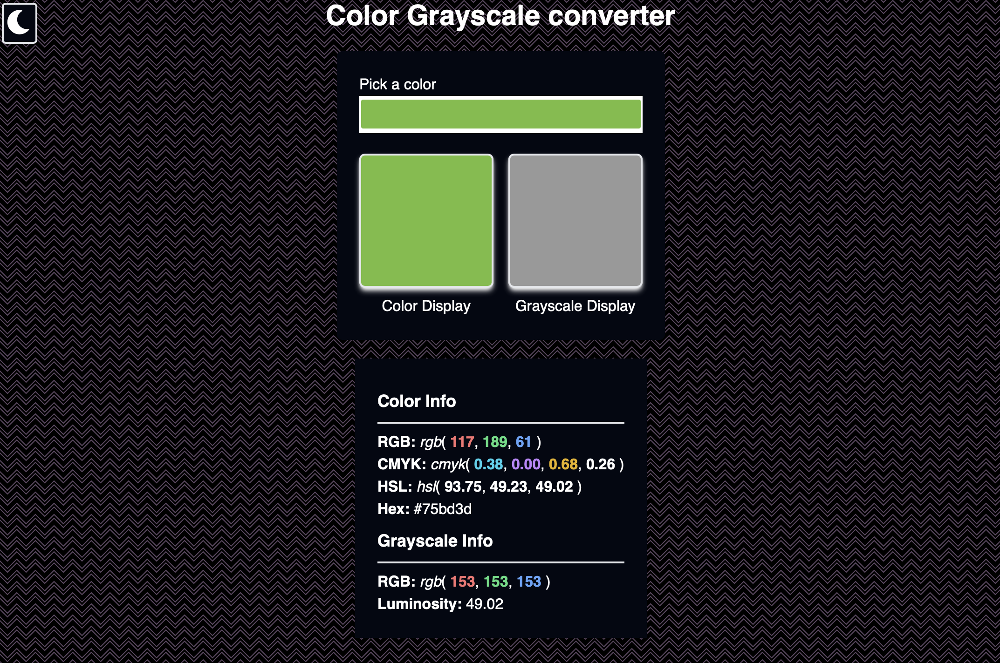

# Color Code To Grayscale Converter

This is a simple javascript shenanigan which converts any given color to its grayscale counterpart. I built this just so I could compare both versions of the same color while drawing or doing artsy stuff. Especially while making pixel art, it is crucial to determine the luminosity index of each color so that you can lay the black and white pixels first and when the dull layout of the scene is ready, then you start to color it. 

## Website Is Live [Here](https://blankscreen-exe.github.io/ColorToGrayScale-converter/)!

## Technologies

Just plain old `Javascript` also `tailwind`.

## Grayscale Conversion Methods

I used "luminosity" method to calculate the grayscale version of the picked color. But I also have the "average" method available to use as well.

### Luminosity Method

```js
grey = (red × 0.3 + green × 0.59 + blue × 0.11)
```

### Average Method

```js
average = (red + green + blue) ÷ 3
rgb(average, average, average) // see what we did here?
```

> Both the methods can be seen in detail [here](https://tabreturn.github.io/code/html/javascript/2017/01/26/converting_css_colour_to_greyscale.html)

## Preview


